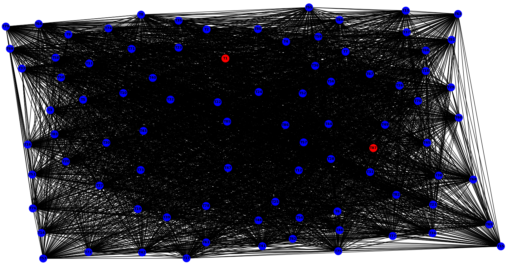
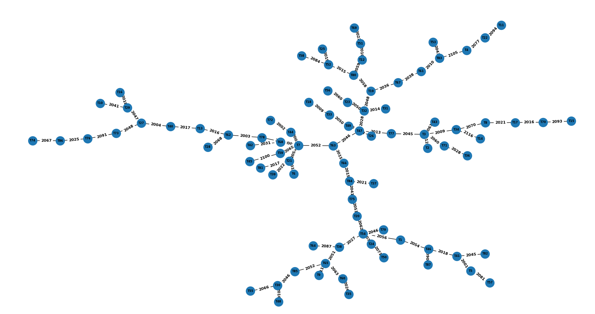
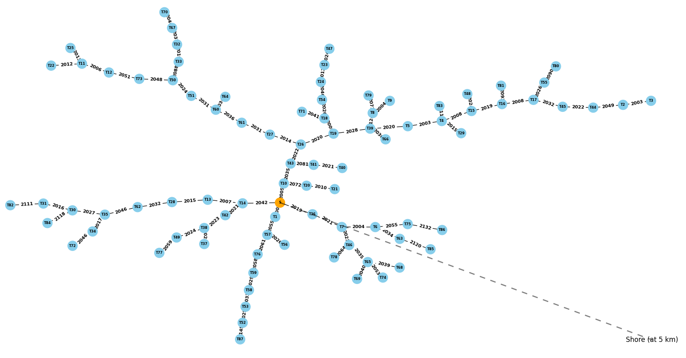

# Wind Park Graph
This project provides a solution to model a wind park as a graph, where each wind turbine is a node and the cables connecting them are the edges. The distance between two wind turbines is constrained to be at least three times their rotor diameter. The wind park graph also includes a method to check if any two cables intersect or touch.

The main class is WindParkGraph, which has the following methods:

add_turbine(turbine): adds a WindTurbine object to the graph.
add_edge(ID1): adds an edge between the wind turbine with ID ID1 and all other wind turbines that meet the distance constraint. If an edge already exists, it updates its weight with a random value between 300 and 3000.
check_cables(): returns a list of tuples with the intersecting or touching cables in the graph.
The WindTurbine class represents a wind turbine with an x and y coordinate, and an ID. It has a distance() method that returns the distance between two wind turbines using the Pythagorean theorem.

# The project consists of 3 main modules:
1. *graph.py* creates then draws a graph representing a wind parks (in my example of 87 wind turbines). The graph respects the distance and overlapping constrains (mentioned above)
    <figure>
    
    <figcaption>Figure 1: Output when graph.py</figcaption>
    </figure>
2. *kruskal_algorithm.py* uses the kryskal algorithm to compute the MST for the graph created in graph.py
    <figure>
    
    <figcaption>Figure 2: Output when running kruskal_algorithm.py</figcaption>
    </figure>
3. *substation.py* computes the local connectivity and the degrees of the computed MST graph then takes the nodes that has the highest degree as a substation (or aggregation node)
    <figure>
    
    <figcaption>Figure 3: Output when running substation.py</figcaption>
    </figure>